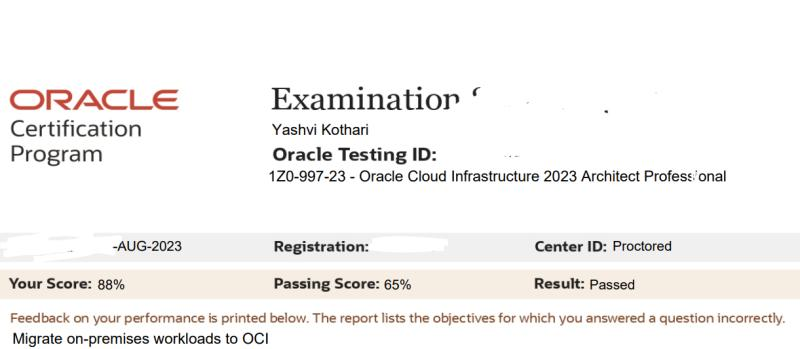

.%E2%9C%8D;Welcome!+:%29) 

### Hi there 👋

- currently github readme.md/YashviKothari diplaying markdown skills and enhancing frontend ui/ux experience.
  
-  learning space is for open source and creative building only and may/maynot work as proper education/professional purpose.
  
- Professionals/Maintainers/Customer/Students can find as many bugs and open issues,do creativity, suggest there personal docs for learning.

- note:too much complexity may occur in software/security due to making 1 thing do things of two.

- 🔭 I’m AWS Community Builder and currently working FTE Associate Security Analyst - Cloud Security Customer Success (love being IT /Security Sasta Startup Mazdur 🙂,life-long intern & learner)
  1.AWS, Microsoft  & Oracle Cloud Infrastructure Architecture,Operations,Cost Optimization & Security(Prod,UAT & Staging).
  2.Trend Micro Cloud One & Endpoint Projects,Integration,Data Collection,POCs,Automtion and Process
  3.Orca Security and Palo Alto POCs
  4.In House SOC PROD Audit,CSPM
  5.In-house Logging and SIEM solution,Wazuh based.

- 🌱 I’m currently learning Web Development, Cloud,System Design,Security Products and Security Architecture.
  
- 👯 I’m looking to collaborate on soft skills,people skills,hands-on skills,finetuning all technical KBs from professional level in terms of writing, e-mail writing,testing & acceptance.
  
- 🤔 I’m looking for help with some good open source projects and having PROD type access to shadow and document along with team.
  
- 💬 Let's do chit-chat about security and software engineering for everyone and impact for our developer community by assisting them.

- ✍ Love writing Technical,How-to, why,what in-depth Blogs on Hashnode & Medium.

- ✨ Out of work, find me walking,driving car,eating,reading Finance,Philosophy, engaging funny Darshan Raval Memes on Twitter(X), playing Taekwondo games or listening music & bhajans.
  
- 📫 How to reach me
   
  My Letter/Mail box

  
  <a href="mailto:yashvikothari@outlook.com" target="_blank" rel="noopener noreferrer">
  yashvikothari@outlook.com</a>

- 😄 Pronouns
   
  She/Her

- 🛠 Skillset
  
  💻 &nbsp; Python | Javascript
  
  🌐 &nbsp; HTML | CSS | Bootstrap | Javascript | React.js | Node.js | Next.js
  
  🧛‍♀️ &nbsp; People Management | RnD | Innovation | 70 hours work week | Business Process | Taking Interviews | Give & Take mentorship
  
  ☁ &nbsp; Google Cloud Platform |Oracle Cloud Infrastructure | Amazon Web Services | Microsoft Azure | Netlify | Docker | Kubernetes
  
  🔧 &nbsp; Github | Repl | Visual Studio code | Excel | Git
      
- ⚡ Fun fact 
   
   Started Taekwondo 🥋 @ 22 and want to repeat 1 type of kick on loop 😂

   Yashvi Kothari 💙 Darshan Raval

☕  ultimate solution for any stress ---> bhajan,chai,maggi,paanipuri,coldcofee,sun,clouds,moon,music,garden,take rest & sleep & again bounce back to the goal for creatively & with stupidly asking questions,try to solve difficult problem first/implemented feature task/same,how & why it work at first place, checking alternatives,solve own fear by practicing,documenting,recalling if anyone else came & if deleted i can recreate.

<h2  align="center" width="100%" style='margin-top: 55px '>
    
    Softwares, Languages and Tools:
</h2>

<h3 align="left">Programming Language</h3>

<h3 align="left">Frontend</h3>

<h3 align="left">Backend</h3>

<h3 align="left">Cloud</h3>

<h3 align="left">Database</h3>

  
 
 

 

<h3 align="left">Support Web -Others</h3>

<h3 align="left">Social Media</h3>

 

 
- 👶My Github Report Card
  
  <h3 align="center"></h3>

  

     
    
    Github Visitors Count

  

|                                                                                                                                                                     |                                                                                                                                                 |
| :-----------------------------------------------------------------------------------------------------------------------------------------------------------------: | :---------------------------------------------------------------------------------------------------------------------------------------------: |
|  |  |

<h3> 💻 Experience </h3>

<table>
  <thead align="center">
     <td><b>Role</b></td>
      <td><b>Company</b></td>
      <td><b>Start Date</b></td>
      <td><b>End Date</b></td>
      <td><b>Duration</b></td>
    </tr>
  </thead>
  <tbody>
    <tr>
	    <td><b>Associate Security L1 </b></a></td>
      <td>Eventus Security</td>
      <td>Aug 2022</td>
      <td>Present</td>
      <td>-</td>
    </tr>
	 <tr>
	    <td><b>Cloud Infrastructure Consultant</b></a></td>
      <td>Synoptek</td>
      <td>January 2022</td>
      <td>July 2022</td>
      <td>6 months</td>
    </tr>
</tbody>
</table>
<h3>🍨Opensource,Contributions,Internship,Engineering & Volunteering</h2>
<table>
  <thead align="center">
    <tr border: none;>
      <td><b>Contribution</b></td>
      <td><b>Company/open Source/NGO</b></td>
    </tr>
  </thead>
  <tbody>
      <tr>
	  <td><b>AWS Cloud Operations Community Builder</b></a></td>
      <td>Amazon Web Services</td>
     </tr>
    <tr>
	  <td><b>One To One Meeting Scheduler Wordpress Prototype</b></a></td>
      <td>NMR Enterprise</td>
     </tr>
	 <tr>
	    <td><b>AR Filters Instagram (MSFT Spark and javascript)</b></a></td>
      <td>mycrxn</td>
      </tr>
      <tr>
	    <td><b>Cyber Security Awareness and Pentesting Projects</b></a></td>
      <td>VIEH,HackersDaddy & CyberHakz</td>
      </tr>
      	    <td><b>Graphic Designing & Fund Raising</b></a></td>
      <td>Hamari Pahchan NGO </td>
      </tr>
      <tr>
	    <td><b>LMS Application - Pandemic Education & Account Admin </b></a></td>
      <td>Darshana Mam</td>
      </tr>
      	    <td><b>T-Shirt Designing & Collaboration</b></a></td>
      <td>Tee-Point </td>
      </tr>
      <td><b>ITV & Movie Critics,Design,Video Editing,Story Telling,Fiction Writing,Account Handling</b></a></td>
      <td>Tadka Entertainment & Digimad </td>
      </tr>
</tbody>
</table>

<h3> 🎓 Education </h3>
<table>
  <thead align="center">
    <tr border: none;>
      <td><b>Board</b></td>
      <td><b>Institute</b></td>
      <td><b>Stream</b></td>
      <td><b>Marks</b></td>
    </tr>
  </thead>
  <tbody>
  <tr>
	  <td><b>Gujarat Technological University</b></a></td>
      <td>Adani Institute of Infrastructure Engineering</td>
      <td>
      Bachelor of Engineering, Information Communication Technology</td>
      <td>8.16 CGPA</td>
  </tr>
  <tr>
	  <td><b>Gujarat Higher Secondary Education Board </b></a></td>
      <td>Best High School</td>
      <td>PCM(STEM) HSC </td>
      <td>- AIR JEE(Mains) under 92K
      - AIR JEE (Advance) score 64
      - PR 66.44
      </td>
  </tr>
  <tr>
	<td><b>Gujarat Secondary Education Board </b></a></td>
      <td>Best High School</td>
      <td>SSC</td>
      <td> - PR 93.84
      </td>
  </tr>
</table>

<h3> 💯Profesional Certification </h3>

 

### Blogs posts from dev.to
<!-- BLOG-POST-LIST:START -->
<!-- BLOG-POST-LIST:END -->

### Blogs posts from medium
<!-- BLOG-POST-LIST:START -->
<!-- BLOG-POST-LIST:END -->

### Blogs posts from hashnode
<!-- BLOG-POST-LIST:START -->
<!-- BLOG-POST-LIST:END -->

<section>

<h3> 🤝🏻Socials </h3>

<a href="https://twitter.com/kothari_yashvi" target="_blank" rel="noopener noreferrer">
<a href="https://youtube.com/mycrxn" target="_blank" rel="noopener noreferrer">
<a href="https://linkedin.com/in/yashvikothari" target="_blank" rel="noopener noreferrer">
<a href="mailto:yashvikothari@outlook.com" target="_blank" rel="noopener noreferrer">
<a href="https://medium.com/@yashvikothari" target="_blank" rel="noopener noreferrer">

<a href="https://yashvikothari.hashnode.dev/" target="_blank" rel="noopener noreferrer">

  

<section>

----------

----

